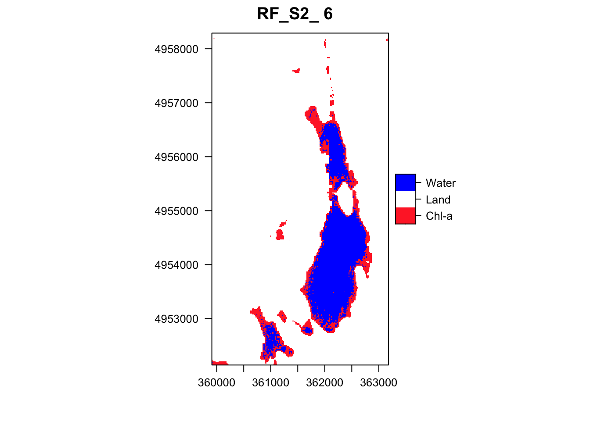

## Introduction

As the world is facing a wide variety of challenges, reliable information is required to assist and help in the decision-making process. Different methods can be used to gather it but satellite Earth Observation offers a suitable approach based on the coverage and type of data that are provided.

Reliable information on agriculture and crops is required to assist and help in the decision-making process of different applications. Different methods can be used to gather this information, but satellite earth observation offers a suitable approach based on the coverage and type of data that are provided.

A few years ago, the European Union (EU) started an ambitious program, Copernicus, which includes the launch of a new family of earth observation satellites known as the Sentinels. Amongst other applications, this new generation of remote sensing satellites will improve the observation, identification, mapping, assessment, and monitoring of crop dynamics at a range of spatial and temporal resolutions.

This R Markdown document outlines the process of classifying Harmful Algal Blooms (HABs) using Sentinel-2 satellite imagery. The workflow includes data preparation, image processing, chlorophyll index calculation, and machine learning classification techniques.


## Loading Required Packages

We start by loading all necessary R packages for our analysis.

```{r load-packages}
# Creating a vector of required packages for spatial analysis, visualization, and machine learning  
pck <- c("sp", "tidyr", "rgdal", "ggplot2", "viridisLite", "viridis",  
          "sf", "tidyverse", "rgeos", "randomForest", "reshape2",  
          "RColorBrewer", "caret", "raster", "e1071", "rasterVis",  
          "tools", "leaflet", "gridExtra", "RColorBrewer", "plotly",  
          "sen2r", "geojsonlint", "stars")  

# Checking for packages not yet installed and installing them  
new_pck <- pck[!pck %in% installed.packages()[,"Package"]]  
if(length(new_pck)) { install.packages(new_pck) }  

# Load all the required packages  
sapply(pck, require, character.only = TRUE)
```


+------------------+-------------------------------------------------------------------+---------------------------------------------------------------------------------------------------------------------------------------------------------------------------+
| Packages         | Name                                                              | Description                                                                                                                                                               |
+==================+===================================================================+===========================================================================================================================================================================+
| ### tidyr        | Tidy Messy Data                                                   | Tools to help to create tidy data, where each column is a variable, each row is an observation, and each cell contains a single value.                                    |
+------------------+-------------------------------------------------------------------+---------------------------------------------------------------------------------------------------------------------------------------------------------------------------+
| ### rgdal        | Bindings for the 'Geospatial' Data Abstraction Library            | Provides bindings to the 'Geospatial' Data Abstraction Library                                                                                                            |
+------------------+-------------------------------------------------------------------+---------------------------------------------------------------------------------------------------------------------------------------------------------------------------+
| ### ggplot2      | Create Elegant Data Visualisations Using the Grammar of Graphics  | A system for 'declaratively' creating graphics, based on "The Grammar of Graphics".                                                                                       |
+------------------+-------------------------------------------------------------------+---------------------------------------------------------------------------------------------------------------------------------------------------------------------------+
| ### raster       | Geographic Data Analysis and Modeling                             | Reading, writing, manipulating, analyzing and modeling of spatial data.                                                                                                   |
+------------------+-------------------------------------------------------------------+---------------------------------------------------------------------------------------------------------------------------------------------------------------------------+
| ### leaflet      | Create Interactive Web Maps with the JavaScript 'Leaflet' Library | Create and customize interactive maps using the 'Leaflet' JavaScript library and the 'htmlwidgets' package.                                                               |
+------------------+-------------------------------------------------------------------+---------------------------------------------------------------------------------------------------------------------------------------------------------------------------+
| ### rasterVis    | Visualization Methods for Raster Data                             | Methods for enhanced visualization and interaction with raster data.                                                                                                      |
+------------------+-------------------------------------------------------------------+---------------------------------------------------------------------------------------------------------------------------------------------------------------------------+
| ### gridExtra    | Miscellaneous Functions for "Grid" Graphics                       | Provides a number of user-level functions to work with "grid" graphics, notably to arrange multiple grid-based plots on a page, and draw tables.                          |
+------------------+-------------------------------------------------------------------+---------------------------------------------------------------------------------------------------------------------------------------------------------------------------+
| ### RColorBrewer | ColorBrewer Palettes                                              | Provides color schemes for maps (and other graphics) designed by Cynthia Brewer as described at [http://colorbrewer2.org](http://colorbrewer2.org/).                      |
+------------------+-------------------------------------------------------------------+---------------------------------------------------------------------------------------------------------------------------------------------------------------------------+
| ### plotly       | Create Interactive Web Graphics via 'plotly.js'                   | Create interactive web graphics from 'ggplot2' graphs and/or a custom interface to the (MIT-licensed) JavaScript library 'plotly.js' inspired by the grammar of graphics. |
+------------------+-------------------------------------------------------------------+---------------------------------------------------------------------------------------------------------------------------------------------------------------------------+
| ### sen2r        | Find, Download and Process Sentinel-2 Data                        | Functions to download Sentinel-2 optical images and perform preliminary processing operations.                                                                            |
+------------------+-------------------------------------------------------------------+---------------------------------------------------------------------------------------------------------------------------------------------------------------------------+
| ### GeoJSON      | Tools for Validating 'GeoJSON'                                    | Tools for linting 'GeoJSON'.                                                                                                                                              |
+------------------+-------------------------------------------------------------------+---------------------------------------------------------------------------------------------------------------------------------------------------------------------------+

Packages Description

## Sentinel-2

The Copernicus Sentinel-2 mission comprises a constellation of two polar-orbiting satellites placed in the same sun-synchronous orbit, phased at 180° to each other. It aims at monitoring variability in land surface conditions, and its wide swath width (290 km) and high revisit time (10 days at the equator with one satellite, and 5 days with 2 satellites under cloud-free conditions which results in 2-3 days at mid-latitudes) will support monitoring of Earth's surface changes.


## Provide Time Series Data

`{r} #library(sen2r) #sen2r()}`

first of all in Product selection, select RAW files and then connect to your SciHub account. Also, you can filter your data based on cloud cover (Max.SAFE cloud cover). (proper value is 25%)


Then choose Spatial-Temporal selection


## Processing (Atmospheric correction)

Sen2Cor is a processor for Sentinel-2 Level 2A product generation and formatting; it performs the atmospheric-, terrain and cirrus correction of Top-Of- Atmosphere Level 1C input data. Sen2Cor creates Bottom-Of-Atmosphere, optionally terrain- and cirrus corrected reflectance images; additional, Aerosol Optical Thickness-, Water Vapor-, Scene Classification Maps and Quality Indicators for cloud and snow probabilities. Its output product format is equivalent to the Level 1C User Product: JPEG 2000 images, three different resolutions, 60, 20 and 10 m.


-   Convert Sentinel-2 L1C to L2A (Using sen2cor plugin)

    [](https://youtu.be/uCaVjt5FYiM?si=R_6U21qKsYcAtnaX)

<https://youtu.be/uCaVjt5FYiM?si=R_6U21qKsYcAtnaX>

## Data Preparation

### Loading Study Area and Points

```{r load-study-area}
# Load study area and points
study_area <- readOGR("/Users/mostafa_Saghafi/Desktop/Detecting HAB/Study_Area/torment.shp")
study_point <- readOGR("/Users/mostafa_Saghafi/Desktop/Detecting HAB/Study_Points/points.shp")

# Load training and validation data
training <- readOGR("/Users/mostafa_Saghafi/Desktop/Detecting HAB/Train/Train.shp")
validation <- readOGR("/Users/mostafa_Saghafi/Desktop/Detecting HAB/Test/Test.shp")
```

### Processing Sentinel-2 Data

```{r process-sentinel2}
# List all Sentinel-2 bands (2, 3, 4, 5, 6, 7, 8) available in the specified folder  
S2 <- "/Users/mostafa_Saghafi/Desktop/S2A_MSIL2A_20220627T151701_N0400_R025_T20TLQ_20220627T215912.SAFE"  
S2 <- list.files(S2, recursive = TRUE, full.names = TRUE, pattern = "B(0[2348]_10m|0[567]_20m).jp2$")  
# Read each band as raster objects  
S2 <- lapply(1:length(S2), function(x) { raster(S2[x]) })  
# Display the first band  
S2[1]  
```

## **Crop, Resample, and Stack the Images**

```{r}
# Resampling bands with 20m resolution to 10m using disaggregate if required  
S2_rsp <- lapply(S2, FUN = function(S2) {   
  if (xres(S2) == 20) {   
    disaggregate(S2, fact = 2, method = "")   
  } else {   
    S2   
  }   
})  

# Stacking the resampled images  
S2_images <- stack(S2_rsp)  
# Converting stack to brick for easier manipulation  
S2_br <- brick(S2_images)  
# Crop images to the study area defined earlier  
s <- crop(S2_br, study_area)  

# Write the cropped raster to a TIFF file  
writeRaster(s, filename = "/Users/mostafa_Saghafi/Desktop/Detecting HAB/Output_Data/S2_crop_27062022", format = "GTiff", overwrite = TRUE)
```

## Visualization

### RGB Composites

```{r}
# Set layout for plotting  
options(repr.plot.width = 41, repr.plot.height = 20)  
m <- rbind(c(1, 2))  
layout(m)  

# Plot RGB images for visual inspection  
# True color composite using bands 3, 2, and 1 (RGB)  
plotRGB(S2_images, r = 3, g = 2, b = 1, scale = maxValue(S2_images[[2]]), stretch = 'lin')  
# Overlay the study area boundary  
plot(study_area, add = TRUE, border = 'yellow', lwd = 1)  
# False color composite using bands 4, 2, and 1  
plotRGB(S2_images, r = 4, g = 2, b = 1, scale = maxValue(S2_images[[2]]), stretch = 'lin')  
plot(study_area, add = TRUE, border = 'yellow', lwd = 1)
```


## Chlorophyll Index Calculation

We calculate three chlorophyll indices: NDCI, NDRE, and CI(green).

```{r}
# Display cropped images  
options(repr.plot.width = 50, repr.plot.height = 10)  
m <- rbind(c(1, 2))  
layout(m)  
plotRGB(s, r = 3, g = 2, b = 1, scale = maxValue(s[[2]]), stretch = 'lin')  
plotRGB(s, r = 4, g = 3, b = 1, scale = maxValue(s[[2]]), stretch = 'lin')  

# Chlorophyll indices  
# NDCI (Normalized Difference Chlorophyll Index)  
c1 <- (s[[5]] - s[[3]]) / (s[[5]] + s[[3]])  
plot(c1, main = "Chlorophyll NDCI", axes = FALSE, box = FALSE)  

# NDRE (Normalized Difference Red Edge)  
c2 <- (s[[7]] - s[[5]]) / (s[[7]] + s[[5]])  
plot(c2, main = "Chlorophyll NDRE", axes = FALSE, box = FALSE)  

# CI (Chlorophyll Index) using green band  
c3 <- (((s[[7]]) / (s[[2]])) - 1)  
plot(c3, main = "Chlorophyll CI (green)", axes = FALSE, box = FALSE)
```


## **Extract Pixel Values**

```{r}
# Extract pixel values at defined coordinate points  
c1_points <- raster::extract(c1, study_point, method = 'bilinear', df = TRUE)  
c2_points <- raster::extract(c2, study_point, method = 'bilinear', df = TRUE)  
c3_points <- raster::extract(c3, study_point, method = 'bilinear', df = TRUE)  

# Combine extracted data frames for further analysis  
c1_points_df <- do.call("cbind", c1_points)  
c2_points_df <- do.call("cbind", c2_points)  
c3_points_df <- do.call("cbind", c3_points)  

# Remove duplicated columns to clean up data frames  
c1_points_df <- c1_points_df[, !duplicated(colnames(c1_points_df))]  
c2_points_df <- c2_points_df[, !duplicated(colnames(c2_points_df))]  
c3_points_df <- c3_points_df[, !duplicated(colnames(c3_points_df))]  

# Determining min and max values for thresholding  
min1 <- min(c1_points$layer)  
max1 <- max(c1_points$layer)  

min2 <- min(c2_points$layer)  
max2 <- max(c2_points$layer)  

min3 <- min(c3_points$layer)  
max3 <- max(c3_points$layer)
```

## Thresholding

We apply thresholding to the chlorophyll indices.

```{r}
# Thresholding for chlorophyll indices  
options(repr.plot.width = 50, repr.plot.height = 10)  
m <- rbind(c(1, 2, 3))  
layout(m)  

# Reclassifying chlorophyll indices based on calculated thresholds  
chl1 <- reclassify(c1, cbind(max1, Inf, 0))  
chl1 <- reclassify(chl1, cbind(-Inf, -0.000001, 0))  
chl2 <- reclassify(c2, cbind(max2, Inf, 0))  
chl2 <- reclassify(chl2, cbind(-Inf, -0.000001, 0))  
chl3 <- reclassify(c3, cbind(max3, Inf, 0))  
chl3 <- reclassify(chl3, cbind(-Inf, -0.000001, 0))  

# Plot the thresholded results  
plot(chl1, axes = FALSE, box = FALSE, main = 'NDCI')  
plot(chl2, axes = FALSE, box = FALSE, main = 'NDRE')  
plot(chl3, axes = FALSE, box = FALSE, main = 'CI (green)')
```


## **Write Output TIFF Files**

```{r}
# Write the thresholded results to TIFF files  
writeRaster(chl1, filename = "/Users/mostafa_Saghafi/Desktop/Detecting HAB/Output_Data/Chl1", format = "GTiff", overwrite = TRUE)  
writeRaster(chl2, filename = "/Users/mostafa_Saghafi/Desktop/Detecting HAB/Output_Data/Chl2", format = "GTiff", overwrite = TRUE)  
writeRaster(chl3, filename = "/Users/mostafa_Saghafi/Desktop/Detecting HAB/Output_Data/Chl3", format = "GTiff", overwrite = TRUE)  

# Stack the chlorophyll layers with the original cropped data  
s1 <- stack(chl1, chl2, chl3, s)  
print(s1)  

# Export the stacked raster as a TIFF file  
writeRaster(s1, filename = "/Users/mostafa_Saghafi/Desktop/Detecting HAB/Output_Data/Chl_27062022", format = "GTiff", overwrite = TRUE)
```

## **Crop Using the Stars Package**

```{r}
# Crop using the stars package to analyze spatial data  
study_areas <- st_read("/Users/mostafa_Saghafi/Desktop/Detecting HAB/Study_Area/A1.shp")  

# Read previously written chlorophyll TIFF files  
chlr1 <- read_stars("/Users/mostafa_Saghafi/Desktop/Detecting HAB/Output_Data/Chl1.tif")  
chlr2 <- read_stars("/Users/mostafa_Saghafi/Desktop/Detecting HAB/Output_Data/Chl2.tif")  
chlr3 <- read_stars("/Users/mostafa_Saghafi/Desktop/Detecting HAB/Output_Data/Chl3.tif")  

# Crop the chlorophyll data to the study areas  
chl1_crop <- st_crop(chlr1, study_areas)  
chl2_crop <- st_crop(chlr2, study_areas)  
chl3_crop <- st_crop(chlr3, study_areas)
```

## **Plot the Results**

```{r}
# Plot the chlorophyll data for Torment Lake using ggplot and the stars package  
ggplot() +  
  geom_stars(data = chl1_crop) +  
  scale_fill_viridis_c(na.value = "transparent") +  
  geom_sf(data = study_areas, alpha = 0) +  
  coord_sf(datum = st_crs(study_areas))  

ggplot() +  
  geom_stars(data = chl2_crop) +  
  scale_fill_viridis_c(na.value = "transparent") +  
  geom_sf(data = study_areas, alpha = 0) +  
  coord_sf(datum = st_crs(study_areas))  

ggplot() +  
  geom_stars(data = chl3_crop) +  
  scale_fill_viridis_c(na.value = "transparent") +  
  geom_sf(data = study_areas, alpha = 0) +  
  coord_sf(datum = st_crs(study_areas))
```


## K-means Clustering

We apply k-means clustering to our data.

```{r}
# K-means clustering classifier  
set.seed(99)  # Setting random seed for reproducibility  
kMeansResult <- kmeans(s1[], centers = 5)  # Perform k-means clustering with 5 centers  

# Create a dummy raster for storing cluster results and set cluster values  
kmeans_output <- raster(s1[[1]])  
kmeans_output <- setValues(kmeans_output, kMeansResult$cluster)  

# Plot k-means classification result  
options(repr.plot.width = 100, repr.plot.height = 70)  
m <- rbind(c(1))  
layout(m)  
plot(kmeans_output, col = c("lightsalmon1", "azure2", "goldenrod1", "mediumseagreen", "firebrick1", "blue"),  
     axes = FALSE, box = FALSE, main = 'Sentinel-2 | k-means classification')
```


## **Tune Parameters using the Elbow Method**

```{r}
# Derive total within-cluster sum of squares (WSS) to find optimal number of clusters  
wss <- function(k) {  
  kmeans(s1[], k)$tot.withinss  
}  

# Set cluster parameter range from 1 to 15  
k.values <- 1:15  
# Extract WSS for cluster ranges  
wss_values <- map_dbl(k.values, wss)  

# Plot the elbow chart to visualize WSS against number of clusters  
plot(k.values, wss_values,  
     type = "b", pch = 19, frame = FALSE,  
     xlab = "Number of clusters K",  
     ylab = "Total within-clusters sum of squares")
```


## **Visualize Training Data**

```{r}
# Visualize training data locations on the stacked RGB image  
plotRGB(s1, r = 8, g = 7, b = 6, scale = maxValue(s1[[5]]), stretch = "lin")  
plot(training, add = TRUE, col = "orange")
```


## **Rasterize Training Data and Extract Features**

```{r}
# Rasterize training data for classification  
training_r <- rasterize(training, s1[[1]], field = training$train)  
names(training_r) <- "Class"  

#add training raster to stack
S_image_t <- addLayer(s1, training_r)
S_image_t

# Extract band information from imagery using training data  
training_S <- raster::extract(s1, training, df = TRUE)  
training_S$Class <- factor(training_S$Class)  # Convert Class column to factor  
head(training_S)  


# Remove ID column from training dataframe  
training_S$ID <- NULL
```

## Support Vector Machine (SVM) Classification

We use SVM for classification of our Sentinel-2 data.

```{r}
# Tune SVM parameters with 10-fold cross-validation  
SVMachine <- tune.svm(x = training_S[, c(1:(length(training_S) - 1))],   
                       y = training_S$Class,   
                       gamma = 10^(-6:-1),   
                       cost = 10^(-1:1))  

# Train the SVM model using the best parameters obtained from tuning  
SVM <- svm(x = training_S[, c(1:(length(training_S) - 1))],   
            y = training_S$Class,   
            gamma = SVMachine$best.parameters$gamma,   
            cost = SVMachine$best.parameters$cost)  

# Classify the stacked imagery using the trained SVM model  
LC_SVM <- predict(s1, model = SVM, na.rm = TRUE)  

# Visualize the output classification from SVM  
print(LC_SVM)  # Print the classified output  
print(SVM)     # Print the SVM model details  


```


```{r}
# Convert pixel values to factors for color mapping  
LC_SVM <- as.factor(LC_SVM)  
LC_SVM_l <- levels(LC_SVM)[[1]]  
LC_SVM_l[["crop"]] <- c("Chl-a", "Land", "Water")  # Naming the classes  
levels(LC_SVM) <- LC_SVM_l  

# Plot the resulting classification for visual interpretation  
rasterVis::levelplot(LC_SVM, col.regions = c("firebrick1", "white", "blue"),   
                     main = paste("SVM_S2_", "2022-06-27"))
```


## **Evaluate SVM Model**

```{r}
# Rasterize the validation data  
Validation_r <- rasterize(validation, s1[[5]], field = validation$test)  

# Extract values from the validation pixels  
test <- raster::extract(Validation_r, validation, df = TRUE)  
prediction <- raster::extract(LC_SVM, validation, df = TRUE)  

# Create a confusion matrix for validation  
CM_SVM <- caret::confusionMatrix(data = as.factor(prediction$layer), reference = as.factor(test$layer))  
CM_SVM  # Display the confusion matrix
```


## Random Forest Classification

Finally, we apply Random Forest classification.

```{r}
# Random Forest
RF <- randomForest(x=training_S[ ,c(2:(length(training_S)-1))], y=training_S$Class, importance = TRUE, ntree=500)

#classification
LC_RF <- predict(s1, model=RF, na.rm=TRUE)

#visualize output
print(LC_RF)
print(RF)
```

Call:
randomForest(x = training_S[, c(2:(length(training_S) - 1))], y = training_S\$Class, ntree = 500, importance = TRUE)
Type of random forest: classification
Number of trees: 500
No. of variables tried at each split: 3

OOB estimate of error rate: 0.37%
Confusion matrix:
1 2 3 class.error
1 211 0 12 0.0538116592
2 1 2679 0 0.0003731343
3 6 0 2263 0.0026443367

```{r}
#Convert pixle values  to numbers ()
LC_RF<- as.factor(LC_RF)
LC_RF_l<- levels(LC_RF)[[1]]
LC_RF_l[["crop"]]<- c("Chl-a", "Land", "Water")
levels(LC_RF)<-LC_RF_l

#plot classification
rasterVis::levelplot(LC_RF, col.regions=c("firebrick1","white", "blue"), main=paste("RF_S2_", "6"))
```



## **Evaluate RF Model**

```{r}
#Extract values at validation pixels
test<- raster::extract(Validation_r, validation , df=TRUE)
prediction<- raster::extract(LC_RF, validation, df=TRUE)

#creat confusion matrix
CM_RF<- caret::confusionMatrix(data = as.factor(prediction$layer), reference=as.factor(test$layer))
CM_RF
```


## Conclusion

This document demonstrates the process of classifying Harmful Algal Blooms using Sentinel-2 imagery. We've applied various techniques including chlorophyll index calculation, k-means clustering, SVM, and Random Forest classification. The results provide insights into the distribution of HABs in our study area.
